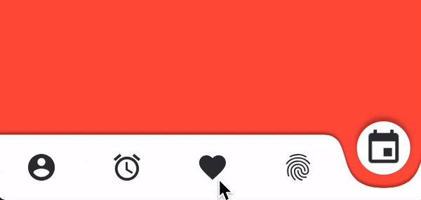

# Limber tab bar
Another iOS tabbar with smooth animation and more limber view. You can implement easily into you current project with just two step.
> Inspired by [this concept](https://dribbble.com/shots/6005981-Tab-Bar-Animation-nr-2) from [Lukas Stranak](https://dribbble.com/LukasStranak)





# Installation
This is the very first released of this library and it is under test. It soon be available on cocoapod repo. Currenly you can install the first version by adding the line below to your `podfile`.

```
pod 'LimberTabbar', :git=> 'https://github.com/afshin-hoseini/LimberTabbar.iOS.git', :tag=> '0.2.0'
```

and then do a `pod install`

# Usage

If you want to use the LimberTabbar alone, just click on your tabbar view in interface builder and from the identity inspector tab, select the `AHLimberTabbar` as class.

If you also want to use the limber tabbar on your `UITabbarController`, in addition to last step, you ought to change your `UITabbarController`'s class to `AHLimberTabbarController` from identity inspector.

# Customization

Currently there isn't many thing to do but you can:

1. Select **bar tint color** by change this property on your tabbar view.
2. Change **Icons' tint color** via selecting appropriate color on  *image tint* property.

You can also specify background and icon tint color for each tab bar item, through changing the tabbarItem's class to `AHLimberTabbarItem` on identity inspector tab, in interface builder.

The `AHLimberTabbar` adjusts the the pit's depth according to the safe area insets. If you wish to ignore the safe area insets, make the `observeSafeAreaInsets` option `off` in interface builder.

# NOTICE
1.  The `AHLimberTabbarController` just overrides the definition of `tabBar(_: didSelect:)` function in order to change the default behaviour of `UITabbarController`. Therefore, it may corrupt you custom code and disable specific delegation.

2.  Current version is just a concept an is not fully tested. Please test it completely along side your development and make sure that meets your needs.

# To do

1. Better `AHLimberTabbarController`.
2. Multiple animations for `AHLimberTabbar`.
3. Custom transition animations for `AHLimberTabbarController`.
4. Showing badges.
